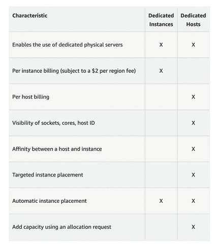
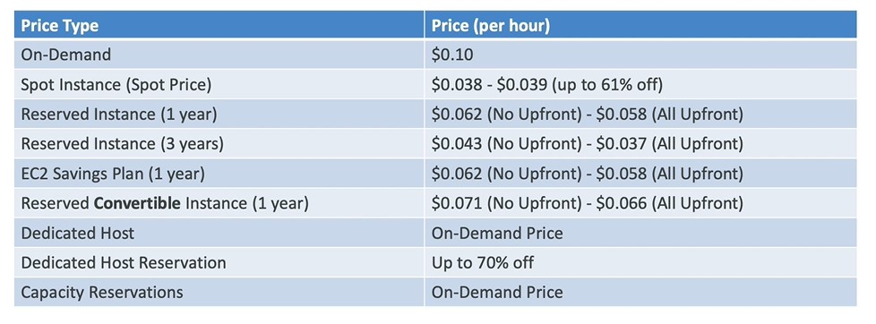
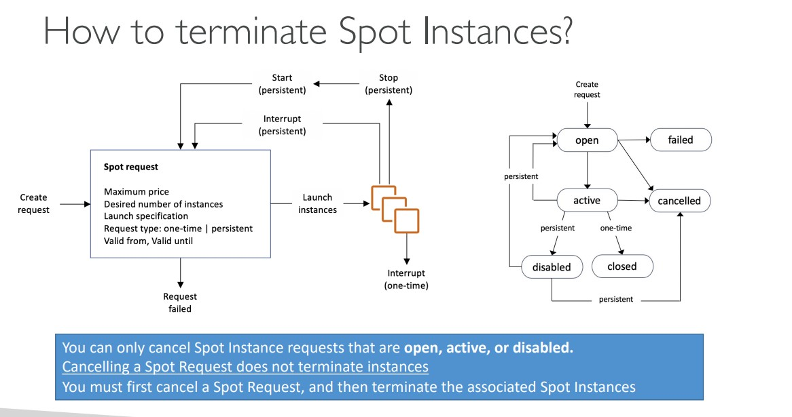

# Amazon EC2

## EC2

- EC2 = Elastic Compute Cloud = Infrastructure as a Service
- It mainly consists in the capability of,
  - Renting virtual machines(EC2 instances)
  - Storing data on virtual drives (EBS)
  - Distributing load across machines (ELB)
  - Scaling the services using an auto-scaling group (ASG)
- Knowing EC2 is fundamental to understand how the Cloud works

## EC2 sizing and configuration options

- Operating System: Linux, Windows or Mac OS.
- How much compute power & cores (CPU)
- How much storage space
  - Network-attached (EBS & EFS)
  - hardware (EC2 Instance Store)
- Network card: speed of the card, public IP address
- Firewall rules: `security group`
- Bootstrap script (configure at first launch): EC2 User Data

## EC2 User Data

- It is possible to bootstrap our instances using an `EC2 User data script`
- Bootstrapping means launching commands when a machine starts.
- That script is only run once at the instance first start
- EC2 user data is used to automate boot tasks such as
  - Installing updates
  - Installing software
  - Downloading common files from the internet
  - Anything you can think of
  - Based on the things we added in the user data, the booting time would vary to start the instance.
- The EC2 User Data Script runs with the root user.

## EC2 Instanc types (example)


## Launching EC2 instance

[Launch EC2 Instance](3.%20Launch-ec2.md)

## EC2 Instance Types

- `General Purpose`
  - Great for a diveristy of workloads such as web servers or code repositories.
  - Balance between,
    - Compute
    - Memory
    - Networking
  - t2.micro is a ec2 instance used for basic purpose.
- `Compute Optimized`
  - Great for compute- intensive tasks that require hight performance processors,
    - Batch processing workloads
    - Media transcoding
    - High performance web servers
    - High performance computing (HPC)
    - Scientific modeling & machine learning
    - Dedicated gaming servers.
  - They are denoted with name `c` (c6g, c6gn, c5, etc)
- `Memory Optimized`
  - Fast performance for workloads that process large data sets in memory.
  - Use cases:
    - High performance, relational/non relational databases.
    - Distributed web scale cache stores.
    - In-memory databases optimized for BI (Business intelligence)
    - Applications performing real-time processing of big unstructured data.
    - They are denoted with R. eg: (R6g, R5, R5a, etc)
- `Accelerated Computing`
- `Storage Optimized`
  - Great for storage intensive tasks that require hight, sequential read and write access to large data sets on local storage.
  - Use cases
    - High frequency online transaction processing (OLTP) systems
    - Relational and NoSql databases
    - Cache for in-memory databases (eg: Redis)
    - Data warehousing applications
    - Distributed file systems.
- `HPC Optimized`
- `Instance Features`
- `Measuring Instance Performance`

### EC2 Instance type naming convention:

`m5.2xlarge`

m: instance class
5: generation (AWS imporoves them over time)
2xlarge: size within the instance class9

## Security Groups

- are the fundamental of network security in AWS
- They control how traffic is allowed into or out of our EC2 instances.
- Security groups only contain allow rules.
- Security groups rules can reference by IP or by security groups.
- For example if an ec2 insance wants to be allowed from a website or outside, we have to configure security group to allow traffic from outside to ec2 and ec2 to outside as below in the diagram.


### Deep dive

- Security groups are acting as a 'firewall' on EC2 instances
- They regulate,
  - Access to ports.
  - Authorised IP ranges - IPv4 and IPv6
  - Control of inbound network (from other to the instance)
  - Control of outbound network (from the instance to other)


### Security groups diagram


### Good to know

security groups,

- can be attached to multiple instances
- Locked down to a region/VPC combination
- Does live `outside` the EC2 - if traffic is blocked the EC2 instance won't see it.
- It's good to maintain on separate security group for SSH access
- If your application is not accessible (timeout), then it's a security group issue.
- If your application gives a `connection refused` error, then it's an application error or it's not launched.
- `All inbound traffic is blocked by default`
- `All outbound traffic is authorized by default.`

### Classic ports to know.

- 22 = SSH (Secure shell) - login to linux instance\
- 21 = FTP (File transfer protocol) - upload files into a file share
- 22 = SFTP (Secure File Transfer Protocol) - upload files using SSH
- 80 = HTTP - access unsecured websites
- 443 - HTTPS - access secured websites.
- 3389 = RDP (Remote Desktop Protocol) - log into a windows instance.

## SSH (Secure shell)

- cli for mac, linux and windows greater than 10.
- Create an ec2 instance. Make sure public IP enabled and .pem(key pair file) file downloaded
- copy .pem file in the current folder.
- Run the below command to ssh using pem file.

  `ssh -i .\ec2.pem ec2-user@54.205.245.140`

## Purchasing option

- `On-Demand Instances`
  - short workload
  - predictable pricing
  - pay by second
- Reserved (1 & 3 years)
  - Reserved Instances - long workloads
  - Convertible Reserved Instances - long workloads with flexible instances
- `Savings plan (1 & 3 years)`
  - commitment to an amount of usage, long workload
- `Spot Instances`
  - short workloads
  - cheap
  - can lose instances (less reliable)
- `Dedicated Hosts`
  - book an entire physical server
  - control instance placement
- `Dedicated Instances`
  - no other customers will share your hardware
- `Capacity Reservations`
  - Reserve capacity in a specific AZ for any duration

### EC2 on Demand

- Pay for what you use:
  - Linux or windows -billing per second, after the first minute
  - All other operating systems - billing per hour
- Has the highest cost but no upfront payment.
- No long-term commitment
- `Recommended for short-term and un-interrupted workloads, where you can't predict how the application will behave.`

### EC3 Reserved Instances

- Up to 72% discount compared to on-demand
- You reserve a specific instance attributes (Instance Type, Region, Tenancy, OS)
- Reservation Period - 1 year (+ discount) or 3 years (+++discount)
- Payment Options - No Upfront(+), Partial Upfront(++), All Upfront(+++)
- Reserved Instances's scope - Regional or Zonal (reserve capacity in an AZ)
- Recommended for steady-state usage applications (think database).
- You can buy and sell in the Reserved Instance Marketplace
- `Convertible Reserved Instance`
  - Can change the EC2 instance type , instance family, OS, Scope and tenancy
  - Up to 66% discount

### Savings plans

- Get a discount based on long-term usage (upto 72% - same as RI)
- Commit to a certain type of usage ($10/hour for 1 to 3 years)
- Usage beyond EC2 savings plan is billed at the On-Demand price
- Locked to a specific instance family & AWS region (eg: M5 in us-east-1)
- Flexible across
  - Instance Size (eg: m5.xlarge, m5.2xlarge)
  - OS (eg: linux, windows)
  - Tenancy (Host, Dedicated, Default)

### Spot Instances

- Can get a discount up to 90% compared to On-demand
- Instances that you can `lose` at any point of time if your max price is less than current spot price
- The Most cost-efficient instances in AWS
- useful for workloads that are resilient to failure,
  - Batch jobs
  - Data analysis
  - Image processing
  - Any distributed workloads
  - Workloads with a flexible start and end time
- Not suitable for critical jobs or databases.

### Dedicated Hosts

- A Physical server with EC2 instance capacity fully dedicated to your use.
- Allows you address compliance requirements and use your existing server bound software licenses (per-socket, per-core, per-VM software licenses)
- Purchasing options:
  - On-demand - pay per second for active Dedicated Host
  - Reserved - 1 or 3 years (No Upfront, partial Upfront, All upfront)
- The most expensive option
- `Useful for software that have complicated licensing model (BYOL - Bring your Own license.) or for companies that have strong regulatory or compliance needs.`

### Dedicated Instances

- Instances run on hardware that's dedicated to you
- May share hardware with other instances in same account
- No control over instance placement (can move hardware after stop/start)



### Capacity reservations

- Reserve On-Demand instances capacity in a specific AZ for any duration
- You always have access to EC2 capacity when you need it
- No time commitment (create/cancel any time), no billing discounts
- Combine with Regional Reserved Instances and Savings Plans to benefit from billing discounts.
- You're charged at On-Demand rate whether you run instances or not
- `Suitable for short-term, uninterrupted workloads that needs to be in a specific AZ`

```md
Consider as resort,

## On demand:

- coming and staying in resort whenever we like, we pay the full price

## Reserved

- like planning ahead and if we plan to stay for a long time, we may get a good discount.

## Savings plan

- Pay a certain amount per hour for certain period and stay in any room type (eg: King, Suite, Sea view)

## Spot instances

- The hotel allows people to bid for the empty rooms and the highest bidder keeps the rooms. You can get kicked out at any time.

## Dedicated Hosts

- We book an entire building of the resort

## Capacity Reservations

- you book a room for a period with full price even you don't stay in it.
```

## Price Comparision



## EC2 Spot Instances and Spot Fleet

### Spot Instanc Requests

- Can get a discount of up to 90% compared to On-demand
- Define `max spot price` and get the instance while current spot price < max
  - The hourly spot price varies based on offer and capacity
  - If the current spot price > your max price yhou can choose to stop or terminate your instance with a 2 minutes grace period
- Other Strategy: `Spot Block`

  - `block` spot instance during a specified time frame (1 to 6 hours) without interruptions.
  - In rare situations, the instance may be reclaimed.
  - `Spot Blocks are no longer available to new AWS customers since july 1st 2021 and won't be supported after December 31, 2022`
  - Used for batch jobs, data analysis or workloads that are resilient to failures.
  - Not great for critical jobs or databases.



### Spot fleets

- Spot Fleets = set of Spot Instances + (optional) On-Demand Instances
- The Spot Fleet will try to meet the target capacity with price constraints
  - Define possible launch pools: instance type (m5.large), OS, Availability Zone
  - Can have multiple launch pools, so that the fleet can choose
  - Spot Fleet stops launching instances when reaching capacity or max cost
- Strategies to allocate Spot Instances:
  - `lowestPrice`: from the pool with the lowest price (cost optimization, short workload)
  - `diversified`: distributed across all pools (great for availability, long workloads)
  - `capacityOptimized`: pool with the optimal capacity for the number of instances
  - `priceCapacityOptimized (recommended)`: pools with highest capacity available, then select the pool with the lowest price (best choice for most workloads)
- `Spot Fleets allow us to automatically request Spot Instances with the lowest price`

## Others

### Private vs Public vs Elastic IP

By default, a EC2 instance come with `a private IP for internal AWS network` and `a public IP for the WWW`.
When we are doing SSH into our EC2 machines, we can't use a private IP, because we are not in the same n/w and we can only use public IP. If the machine stop and then started, `the public IP can change`.

- Public IP:

  - Public Ip means the machine can be identified on the internet
  - Must be unique across the whole web (not two machines can have the same public IP)
  - Can be geo-located easily

- Private IP:

  - Private IP means the machine can only be identified on a private network only.
  - The IP must be unique across the private network
  - BUT two different private networks (two companies) can have the same IPs.
  - Machines connect to WWW using an internet gateway (a proxy)
  - Only a specified range of IPs can be used as private IP

- Elastic IPs
  - When you stop and then start an EC2 instance, it can change its public IP
  - If you need to have a fixed public IP for your instance, you need to an Elastic IP
  - An Elastic IP is a public IPv4 IP you own as long as you don't delete it
  - You can attach it to one instance at a time.
  - With an Elastic IP address, you can mask the failure of an instance or software by rapidly remapping the address to another instance in your account.
  - We can only have 5 Elastic IP in your account (you can ask AWS to increase that)
  - Overall, try to avoid using Elastic IP
    - They often reflect poor architectural decisions.
    - Instead, use a random public IP and register a DNS name to it.
    - or use a load balancer and don't use a public IP

## EC2 Placement groups

- When you launch a new EC2 instance, the EC2 service attempts to place the instance in such a way that all of your instances are spread out across underlying hardware to minimize correlated failures.
- You can use placement groups to influence the placement of a group of interdependent instances to meet the needs of your workload.
- You can create a maximum of 500 placement groups per account in each Region.
- The name that you specify for a placement group must be unique within your AWS account for the Region.
- You can't merge placement groups.
- An instance can be launched in one placement group at a time; it cannot span multiple placement groups.
- `You can't launch Dedicated Hosts in placement groups.`
- `You can't launch a Spot Instance that is configured to stop or hibernate on interruption in a placement group.`
- Depending on the type of workload, you can create a placement group using one of the following placement strategies

`Cluster` – packs instances close together inside an Availability Zone. This strategy enables workloads to achieve the low-latency network performance necessary for tightly-coupled node-to-node communication that is typical of high-performance computing (HPC) applications.

`Partition` – spreads your instances across logical partitions such that groups of instances in one partition do not share the underlying hardware with groups of instances in different partitions. This strategy is typically used by large distributed and replicated workloads, such as Hadoop, Cassandra, and Kafka.

`Spread` – strictly places a small group of instances across distinct underlying hardware to reduce correlated failures.

## Elastic Network Interface (ENI)

- Logical component in a VPC that represents a virtual network card.
- Each ENI can have following attributes,
  - Primary private IPv4, one or more secondary IPv4
  - One Elastic IP (IPv4) per private IPv4
  - One Public IPv4
  - One or more security groups
  - A mac address
- you can create ENI independently and attache them on the fly (move them) on EC2 instances for failover.
- Bound to a specific availability zone (AZ)

## EC2 Hibernate

- Introducing EC2 Hibernate:
  - The in-memory (RAM) state is preserved.
  - The instance boot is much faster! (The OS is not stopped/restarted)
  - Under the hood: the RAM state is written to a file in the root EBS volume.
  - The root EBS volume must be encrypted.
- Use cases
  - Long-running processing
  - Saving the RAM state
  - Services that take time to initialize
- Others
  - Supported instance Families: C3, C4, C5, I3, M3, M4, R3, R4, T2, T3,...
  - Instance RAM size - must be less than 150 GB
  - Instance Size - not supported for bare metal instances.
  - AMI: Amazon Linux 2, Linux AMI, Ubuntu, RHEL, CentOS, Windows...
  - RootVolume: must be EBS, encrypted, not instance store, and large.
  - Available for On-Demand, Reserved and Spot instances.
  - `An instance can not be hibernated more than 60 days.`
