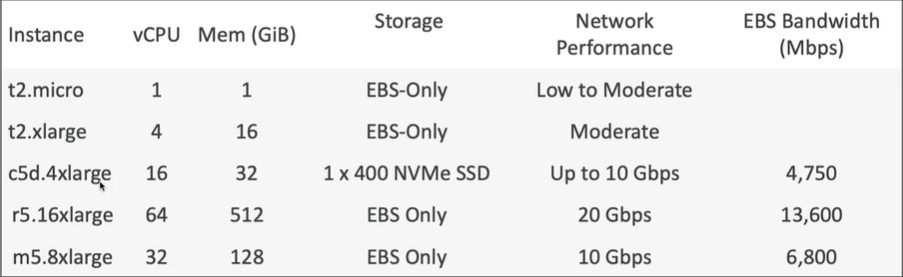
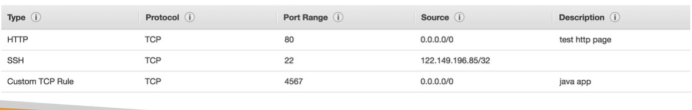
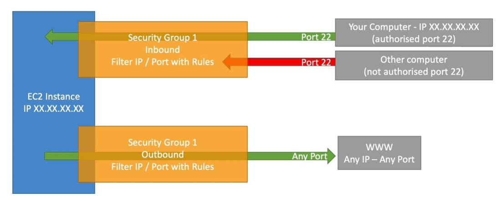
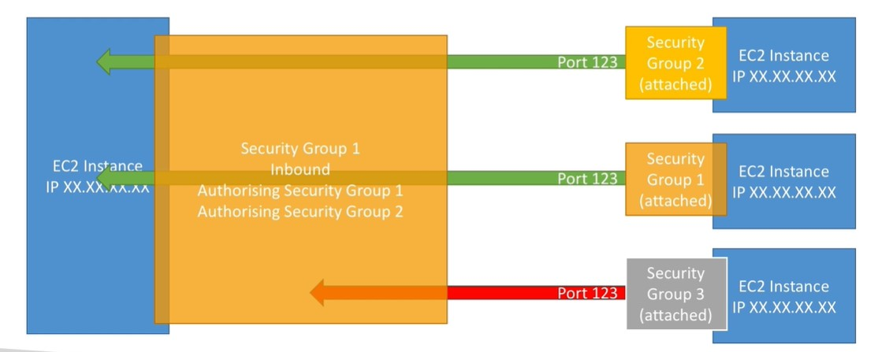

# Amazon EC2

## EC2

- EC2 = Elastic Compute Cloud = Infrastructure as a Service
- It mainly consists in the capability of,
  - Renting virtual machines(EC2 instances)
  - Storing data on virtual drives (EBS)
  - Distributing load across machines (ELB)
  - Scaling the services using an auto-scaling group (ASG)
- Knowing EC2 is fundamental to understand how the Cloud works

## EC2 sizing and configuration options

- Operating System: Linux, Windows or Mac OS.
- How much compute power & cores (CPU)
- How much storage space
  - Network-attached (EBS & EFS)
  - hardware (EC2 Instance Store)
- Network card: speed of the card, public IP address
- Firewall rules: `security group`
- Bootstrap script (configure at first launch): EC2 User Data

## EC2 User Data

- It is possible to bootstrap our instances using an `EC2 User data script`
- Bootstrapping means launching commands when a machine starts.
- That script is only run once at the instance first start
- EC2 user data is used to automate boot tasks such as
  - Installing updates
  - Installing software
  - Downloading common files from the internet
  - Anything you can think of
  - Based on the things we added in the user data, the booting time would vary to start the instance.
- The EC2 User Data Script runs with the root user.

## EC2 Instanc types (example)

## Launching EC2 instance

[Launch EC2 Instance](3.%20Launch-ec2.md)

## EC2 Instance Types

- `General Purpose`
  - Great for a diveristy of workloads such as web servers or code repositories.
  - Balance between,
    - Compute
    - Memory
    - Networking
  - t2.micro is a ec2 instance used for basic purpose.
- `Compute Optimized`
  - Great for compute- intensive tasks that require hight performance processors,
    - Batch processing workloads
    - Media transcoding
    - High performance web servers
    - High performance computing (HPC)
    - Scientific modeling & machine learning
    - Dedicated gaming servers.
  - They are denoted with name `c` (c6g, c6gn, c5, etc)
- `Memory Optimized`
  - Fast performance for workloads that process large data sets in memory.
  - Use cases:
    - High performance, relational/non relational databases.
    - Distributed web scale cache stores.
    - In-memory databases optimized for BI (Business intelligence)
    - Applications performing real-time processing of big unstructured data.
    - They are denoted with R. eg: (R6g, R5, R5a, etc)
- `Accelerated Computing`
- `Storage Optimized`
  - Great for storage intensive tasks that require hight, sequential read and write access to large data sets on local storage.
  - Use cases
    - High frequency online transaction processing (OLTP) systems
    - Relational and NoSql databases
    - Cache for in-memory databases (eg: Redis)
    - Data warehousing applications
    - Distributed file systems.
- `HPC Optimized`
- `Instance Features`
- `Measuring Instance Performance`

### EC2 Instance type naming convention:

`m5.2xlarge`

m: instance class
5: generation (AWS imporoves them over time)
2xlarge: size within the instance class9

## Security Groups

- are the fundamental of network security in AWS
- They control how traffic is allowed into or out of our EC2 instances.
- Security groups only contain allow rules.
- Security groups rules can reference by IP or by security groups.
- For example if an ec2 insance wants to be allowed from a website or outside, we have to configure security group to allow traffic from outside to ec2 and ec2 to outside as below in the diagram.

### Deep dive

- Security groups are acting as a 'firewall' on EC2 instances
- They regulate,
  - Access to ports.
  - Authorised IP ranges - IPv4 and IPv6
  - Control of inbound network (from other to the instance)
  - Control of outbound network (from the instance to other)

### Security groups diagram

### Good to know

security groups,

- can be attached to multiple instances
- Locked down to a region/VPC combination
- Does live `outside` the EC2 - if traffic is blocked the EC2 instance won't see it.
- It's good to maintain on separate security group for SSH access
- If your application is not accessible (timeout), then it's a security group issue.
- If your application gives a `connection refused` error, then it's an application error or it's not launched.
- `All inbound traffic is blocked by default`
- `All outbound traffic is authorized by default.`

### Classic ports to know.

- 22 = SSH (Secure shell) - login to linux instance\
- 21 = FTP (File transfer protocol) - upload files into a file share
- 22 = SFTP (Secure File Transfer Protocol) - upload files using SSH
- 80 = HTTP - access unsecured websites
- 443 - HTTPS - access secured websites.
- 3389 = RDP (Remote Desktop Protocol) - log into a windows instance.
