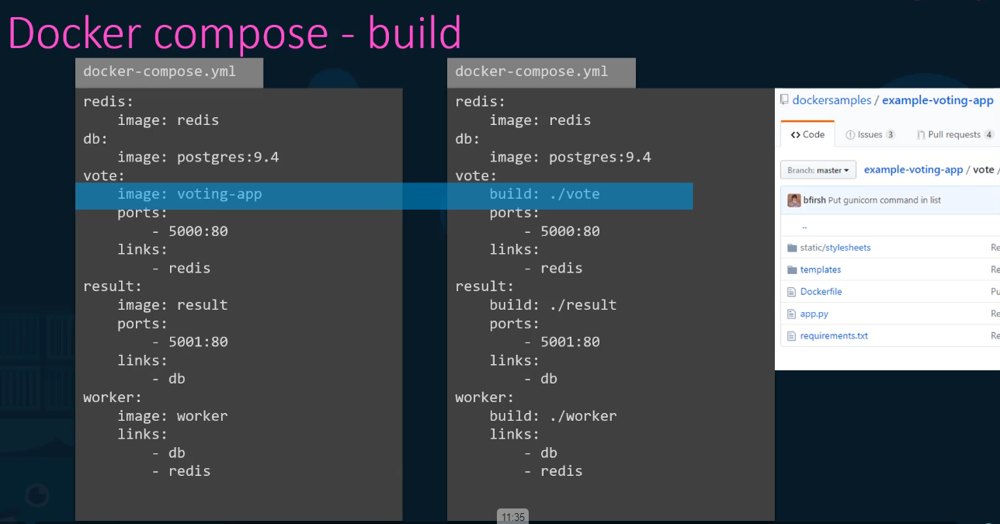
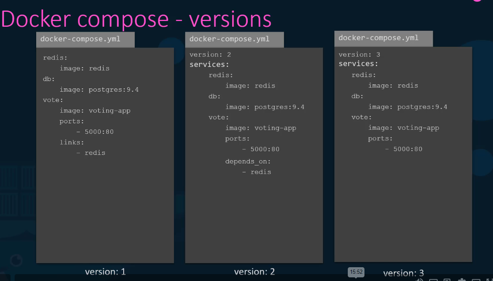
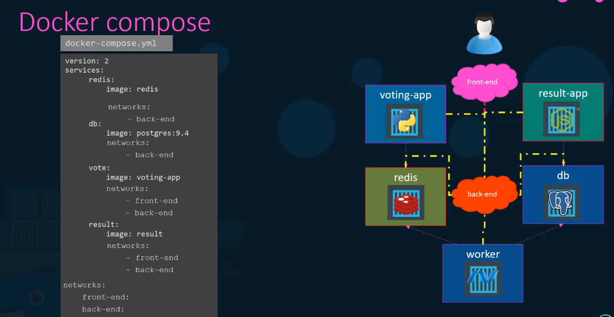

# Docker Commands

## Basic Commands

- docker run `docker run nginx` `Download the image if not exist and run the image`
- docker ps `# to list running containers`
- docker ps -a `# to list running and stopped containers`
- docker stop `docker stop mycontainer` `# To stop a specific ccontainer`
- docker rm `docker rm mycontainer` `# to remove a container`
  `docker rm a03 34j 983 82s` `to remove multiple container`
- docker images `# to list available images in local`
- docker rmi `docker rmi nginx` `To remove a specific image - but before removing all the containers using this image should be deleted before delteting this image`
- docker pull `docker pull nginx` `To download a image not run the command`
- docker run -it myContainer bash `it will run the container and make you go into the container`

## Other commands

Append a command

`docker run ubuntu sleep 5`

Exec - Execute a command with a container

`docker exec mycontainer cat /etc/hosts`

Run - attach and detach

```bash
docker run kodekloud/simple-webapp
docker run -d kodekloud/simple-webapp
docker attach a043d # here a043d is container id
```

## Others

```bash
# To stop all the containers at once, run the command:
docker stop $(docker ps -aq)
# -aq used for display only the ids of the container

# To remove all the stopped containers at once, run the command:
docker rm $(docker ps -aq)

# To remove all the images :
docker rmi $(docker images -aq)

# To run a container and name it
docker run --name webapp nginx:1.14-alpine
```

## Docker Run

### Tags

```bash
docker run redis # uses default tag latest
docker run redis:4.0 # uses 4.0 version tag
```

### Run - Stdin

```bash
docker run -i ganku007/simple-prompt-docker
# run the container in interactive mode`

docker run -it ganku007/simple-prompt-docker`
# run the container interactive mode and into the container
```

### Port mapping

```bash
docker run ganku007/webapp
# consider it is running on http://0.0.0.0:5000/ then it would run in the container

docker run -p 80:5000 ganku007/webapp
# it would map the 5000 port to 80 port of the local machine and we can run the app in our local machine.
```

Other examples:

```bash
docker run –p 8000:5000 ganku007/simple-webapp
docker run –p 8001:5000 ganku007/simple-webapp
docker run –p 3306:3306 mysql
docker run –p 8306:3306 mysql
docker run –p 8306:3306 mysql
```

### Run - volume mapping

```bash
docker run -v /opt/datadir:/var/lib/mysql mysql

# here mysql container uses /var/lib/mysql path to save the data.  So if we dont use volume mapping and run it as `docker run mysql`  when the container stop, all the data would get deleted and start fresh while start again.  so when we do this volume mapping /opt/datadir path would be taken as path to store data so the data would be saved in our local  and data would not get deleted!
```

### Inspect container

`docker inspect mycontainer`

### container logs

`docker logs mycontainer`

### To find the version of the container

```bash
docker run python:3.6 cat /etc/*release*
```

## Docker compose



## Docker versions

### Version 1

The initial version of Docker Compose configuration files.
Simple syntax, limited features.
Does not support Docker Swarm mode.
Deprecated and no longer recommended for use.

### Version 2

- Introduces the version: '2' syntax in the YAML file.
  Supports service definitions, networks, volumes, and dependencies.
- Supports building images from Dockerfiles.
- Supports Docker Swarm mode and network configuration for Swarm services.
- Enables the use of Docker Compose features like extends and external_links.

### Version 2.1

- An extension of version 2 with additional features.
- Introduces the version: '2.1' syntax.
- Adds support for configs and secrets (Docker Swarm-specific features).
- Allows specifying resource limits (CPU and memory) for services.
- Supports setting deploy options for Swarm services.

### Version 3

- Introduces the version: '3' syntax.
- A major update with significant changes and enhancements.
- Adds support for Docker stack deployment (Swarm mode only).
- Simplifies service definitions and network management.
- Introduces concepts like services, networks, volumes, and configs.
- Supports advanced deployment features like rolling updates and health checks for Swarm services.

### Version 3.1, 3.2, 3.3, etc.

- Incremental updates to version 3 with additional features and improvements.
- Introduce new options or refine existing ones.
- Generally maintain compatibility with version 3 syntax while adding new capabilities.

### Version 3.4 (and higher)

- Continues the evolution of version 3 with further enhancements.
- Introduces new features and options as Docker evolves.
- Maintains compatibility with previous version 3 syntax.



## Docker compose - Networks


