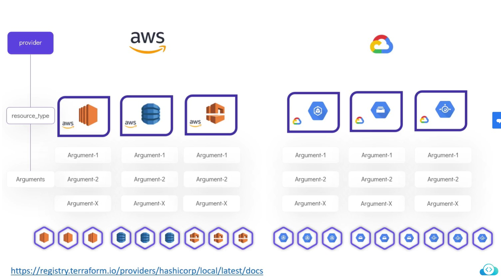
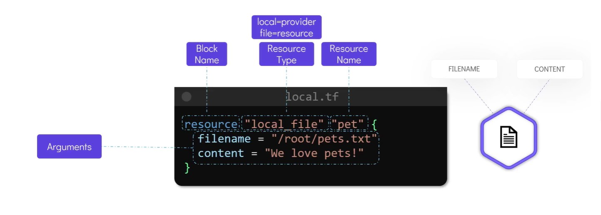
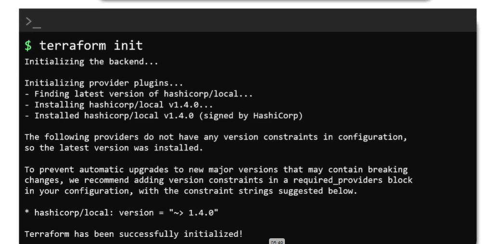
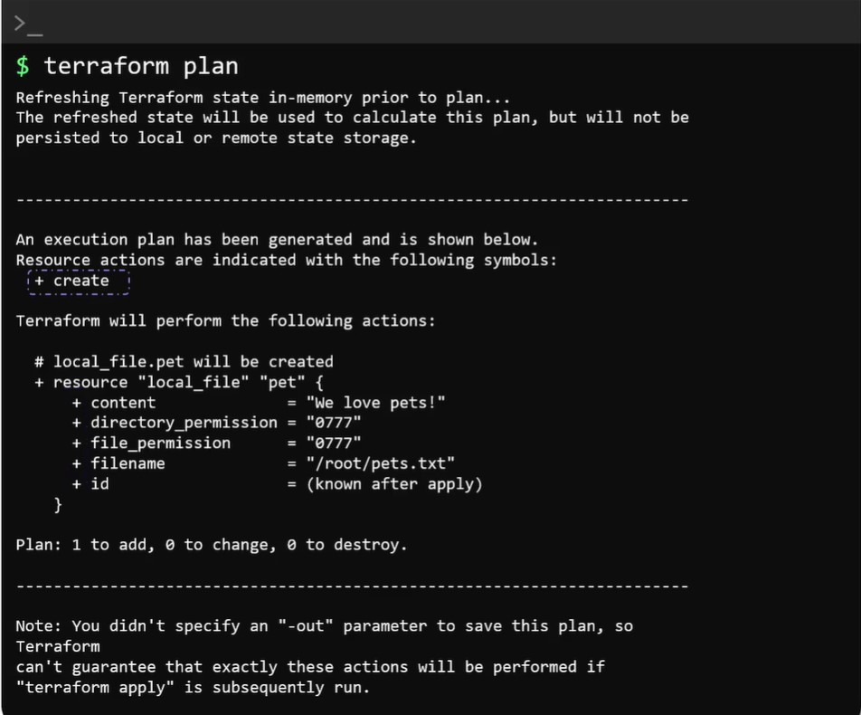
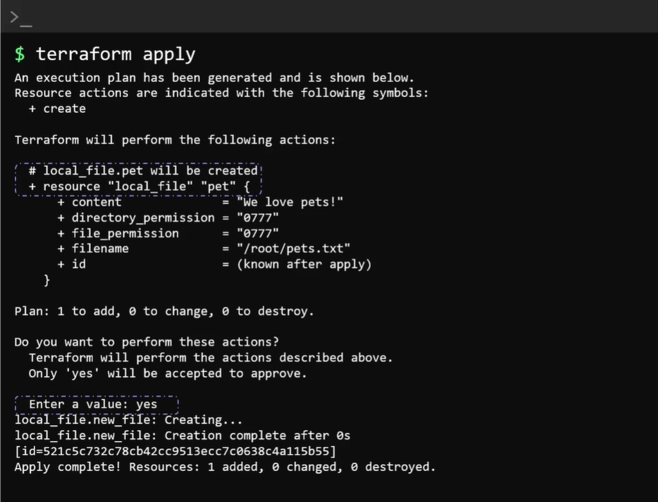

# Terraform

- Open source provisioning template based tool
- It allows to create, edit, delete resource in seconds with the template created.
- Supports multiple platform (AWS, GCP, Azure, VMWare, etc).
- Providers helps terraform to connect with 3rd party API
- Terraform uses the language HCL (Harshicorp configuration language.). It is a simple declarative language, easy to read and write.
- This is declarative and can be managed in version control

## Three phases:

- Init
- Plan
- Apply

## Features

- Uses HCL - Delarative language
- ex:

  ```tf
  resource "aws_instance" "webserver" {
      ami = "ami-Oc2f25c1f66a1ff4d"
      instance_type = "t2.micro"
  }
  ```

- Resource:
  - It could be a file on a local host or it could be a service in AWS/Azure/Google or other supported platforms.

## HCL

Syntax:

```hcl
<block> <parameters>{
    key1 = value1
    key2 = value2
}
```





## Steps

- Init
- Plan
- Apply







## Terraform Commands

```bash
terraform validate   # validate terraform configuration files
terraform fmt    # format the terraform configuration files
terraform show   # show terraform configurations
terraform show -json  # show terraform configurations as json
terraform providers  # show terrform providers used in state/config files
terraform providers mirror /root/terraform/new_local_file # copy terrafrom providers used in state/config files to another file
terraform output # show terraform output variables with value
terraform output <output-parameter-name> # show certain output variable value
terraform refresh  # sync the resources with terraform state file (I would refresh the state file if any manual updates happen in the realtime resources)
terraform plan # Show what are the changes to be done
terraform apply # Process config file and create the resources.  It would create the state file as well for the first time and update the statefile by calling refresh command.  But the refresh can be disabled by below command
terraform plan -refresh=<false/true> # refresh is disabled for plan
terraform apply -refresh=<false/true> # refresh is disabled for apply
terraform graph # show the graph by the statefile and show the dependency graph
terraform graph | dot -Tsvg > graph.svg   # graphviz should be installed.  Show the dependency graph as svg file.
```

## Meta Arguments:

- depends_on:

```tf
resource "local_file" "pet" {
    filename = var.filename
    content = var.content
    depends_on = [
        random_pet.my-pet
    ]
}

resource "random_pet" "my-pet" {
    prefix = var.prefix
    separator = var.separator
    length = var.length
}
```

- lifecycle:

```tf
resource "local_file" "pet" {
    filename = "/root/pets.txt"
    content = "We love pets!"
    file_permission = 0700
    lifecycle {
        create_before_destroy = true
    }
}
```

- Count

```t
resource "local_file" "pet" {
    filename = var.filename[count.index]
    count = 3  # Explicitly mentioned count value as 3
}
variable "filename" {
    default = [
        "/root/pets.txt",
        "/root/dogs.txt",
        "/root/cats.txt"
    ]
}
```

```t
resource "local_file" "pet" {
    filename = var.filename[count.index]
    count = length(var.filename)  # it would pick the length from the filename variable and assigned to count
}
variable "filename" {
    default = [
        "/root/pets.txt",
        "/root/dogs.txt",
        "/root/cats.txt"
        "/root/deer.txt"
        "/root/peacock.txt"
    ]
}
```

- for-each

```t
resource "local_file" "pet" {
    filename = each.value
    for-each =var.filename  # it would pick the length from the filename variable and assigned to count
}
variable "filename" {
    type = set(string)
    default = [
        "/root/pets.txt",
        "/root/dogs.txt",
        "/root/cats.txt"
    ]
}
```

for-each only support only map or set. so if the filename is list type we have to convert it to set by using `toset()` method,

```t
resource "local_file" "pet" {
    filename = each.value
    for-each = toset(var.filename)  # it would pick the length from the filename variable and assigned to count
}
variable "filename" {
    type = list(string)
    default = [
        "/root/pets.txt",
        "/root/dogs.txt",
        "/root/cats.txt"
    ]
}
```

Version Constraints:

```t
terraform {
    required_providers {
        local = {
            source = "hashicorp/local"
            version = "1.4.0"
            # version = "!= 2.0.0"
            # version = "> 1.1.0"
            # version = "> 1.2.0, < 2.0.0, != 1.4.0"
            # version = "~> 1.2"
            # version = "~> 1.2.0"
        }
    }
}

resource "local_file" "pet" {
    filename = "/root/pet.txt"
    content = "We love pets!"
}
```

## Setting variable or input to variables

- By ignore default values (have empty variables.)

  ```tf
  variable "filename" {

  }

  variable "content" {

  }
  ```

  when we have defined empty variables as above, The variables will be prompted while calling Terraform apply.

- By exporting variable,

  ```bash
  > export TF_VAR_filename="/root/pets.txt"
  > export TF_VAR_content="We love pets"
  ```

- While passing variables in terraform apply

  ```bash
  > terraform apply -var "filename=/root/pets.txt" -var "content=We love Pets"
  ```

- By using .tfvars file.

  ```s
  # We can create a .tfvars file and define the variables in the file.

  filename="/root/pets.txt"
  content="We love pets!"

  # here, if we have the filename as terraform.tfvars, terraform.tfvars.json, *.auto.tfvars, *.auto.tfvars.json then terraform automatically pick these files for setting variables values.

  # But if we have any other names for file name we need to mention it in `terraform apply` command, ex: variables.tfvars

  > terraform apply -var-file variables.tfvars
  ```

- Precedence based on highest priority,

  ```txt
  -var or -var-file (command line flags)
  *.auto.tfvars (alphabetical order)
  terraform.tfvars
  Environment variables
  ```

## Make use of one resource to another resource by using reference expression

```tf
resource "local file" "pet" {
    filename = var.filename
    content = "My favorite pet is ${random_pet.my-pet.id}"   # we have used random_pet resource id property to geneate content
}
resource "random_pet" "my-pet" {
    prefix = var.prefix
    separator = var.separator
    length = var.length
}

# In the above scenario, The local file is depend on random_pet resource by using reference expression.  So when the resources are get deleted, terraform would delete the local file first and delete the random_pet next.  In the same way when resources are gets created, random_pet first gets created and the local_file created next.  This is called implicit dependency as we haven't mention the dependency explicitly but with reference expression.
```

## Explicit Dependency using depends_on attribute

```tf
resource "local file" "pet" {
    filename = var.filename
    content = "My favorite pet is cat"
    depends_on = [
        random_pet.my-pet
    ]
}
resource "random_pet" "my-pet" {
    prefix = var.prefix
    separator = var.separator
    length = var.length
}
```

## output variable

```tf
resource "local file" "pet" {
    filename = var.filename
    content = "My favorite pet is ${random_pet.my-pet.id}"   # we have used random_pet resource id property to geneate content
}
resource "random_pet" "my-pet" {
    prefix = var.prefix
    separator = var.separator
    length = var.length
}
output pet-name {
    value = random_pet.my-pet.id
    description = "Record the value of pet Id generated by the random_pet resource"
}

# we can use output type to define output variables.  this can be used to quickly use the resource attirbutes of a resource.
# we can use `terraform output` command to display all the output variables in the current congiruation directory.
# we can use `terraform output pet-name` to display particualt output variable value.
```

## Remote state

- Remote Backends with S3 and Dynamo DB

Here S3 used to store Terraform and Dynamo DB is used to support state locking (and consistent check).

```t

resource "local_file" "pet" {
    filename = "/root/pets.txt"
    content = "we love pets."
}

terraform {
    backend "s3" {
        bucket = "ganesh-terraform-state-bucket01"
        key = "finance/terraform.tfstate"
        region = "us-west-1"
        dynamodb_table = "state-locking"  # this table should have a primary or a hash key with the name lockID.
    }
}

```

- Terraform state commands

```shell
terraform state list [options] [address]

# aws_dynamodb_table.cars
# aws_s3_bucket.finance-2020922

terraform state list aws_s3_bucket.finance-2020922
# aws_s3_bucket.finance-2020922

terraform state show [options] [address]

terraform state show aws_s3_bucket.finance-2020922

terraform state mv [options] SOURCE DESTINATION  # Moving state file from one to another

terraform state mv "aws_dynamodb_table.state-locking" to "aws_dynamodb_table.state-locking-db"

terraform state pull | jq '.resources[] | select(.name == "state-locking-db")|.instances[].attributes.hash_key'

# LockID

terraform state rm <RESOURCE-ADDRESS>  # Remove an item from terraform state file

# Acquiring state lock.  This may take a few moments...
# Removed aws_s3_bucket.finance-2020922
# Successfully removed 1 resource instance(s)
# Releasing state lock.  This may take a few moments...
```

## Terraform `Taint`
